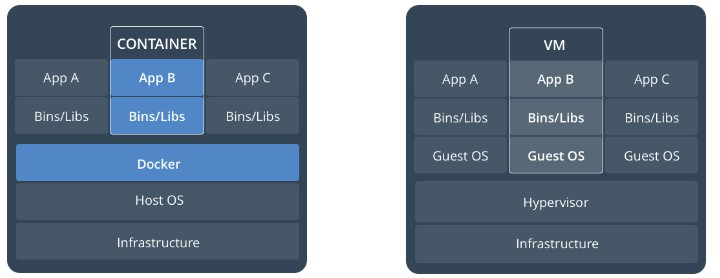
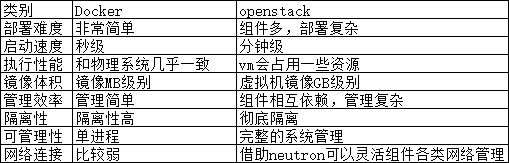
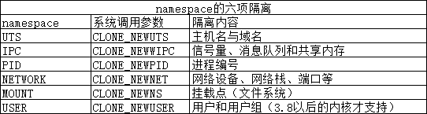

**Docker1 架构原理**

## 一、简介

### 1、了解docker的前生LXC

LXC为Linux Container的简写。可以提供轻量级的虚拟化，以便隔离进程和资源，而且不需要提供指令解释机制以及全虚拟化的其他复杂性。相当于C++中的NameSpace。容器有效地将由单个操作系统管理的资源划分到孤立的组中，以更好地在孤立的组之间平衡有冲突的资源使用需求。

与传统虚拟化技术相比，它的优势在于：

（1）与宿主机使用同一个内核，性能损耗小；

（2）不需要指令级模拟；

（3）不需要即时(Just-in-time)编译；

（4）容器可以在CPU核心的本地运行指令，不需要任何专门的解释机制；

（5）避免了准虚拟化和系统调用替换中的复杂性；

（ 6）轻量级隔离，在隔离的同时还提供共享机制，以实现容器与宿主机的资源共享。

总结：Linux Container是一种轻量级的虚拟化的手段。

Linux Container提供了在单一可控主机节点上支持多个相互隔离的server container同时执行的机制。Linux Container有点像chroot，提供了一个拥有自己进程和网络空间的虚拟环境，但又有别于虚拟机，因为lxc是一种操作系统层次上的资源的虚拟化。

### 2、LXC与docker什么关系？

docker并不是LXC替代品，docker底层使用了LXC来实现，LXC将linux进程沙盒化，使得进程之间相互隔离，并且能够控制各进程的资源分配。

在LXC的基础之上，docker提供了一系列更强大的功能。

### 3、什么是docker

docker是一个开源的应用容器引擎，基于go语言开发并遵循了apache2.0协议开源。

docker可以让开发者打包他们的应用以及依赖包到一个轻量级、可移植的容器中，然后发布到任何流行的linux服务器，也可以实现虚拟化。

容器是完全使用沙箱机制，相互之间不会有任何接口（类iphone的app），并且容器开销极其低。

### 4、docker官方文档

https://docs.docker.com/

### 5、为什么docker越来越受欢迎

**因为容器是：**

- 灵活：即使是最复杂的应用也可以集装箱化。
- 轻量级：容器利用并共享主机内核。
- 可互换：您可以即时部署更新和升级。
- 便携式：您可以在本地构建，部署到云，并在任何地方运行。
- 可扩展：您可以增加并自动分发容器副本。
- 可堆叠：您可以垂直和即时堆叠服务。

**镜像和容器（contalners）**

通过镜像启动一个容器，一个镜像是一个可执行的包，其中包括运行应用程序所需要的所有内容包含代码，运行时间，库、环境变量、和配置文件。

容器是镜像的运行实例，当被运行时有镜像状态和用户进程，可以使用docker ps 查看

**容器和虚拟机**

容器时在linux上本机运行，并与其他容器共享主机的内核，它运行的一个独立的进程，不占用其他任何可执行文件的内存，非常轻量

虚拟机运行的是一个完成的操作系统，通过虚拟机管理程序对主机资源进行虚拟访问，相比之下需要的资源更多

### 6、docker版本

Docker Community Edition（CE）社区版

Enterprise Edition(EE) 商业版

### 7、docker和openstack的几项对比

 

### 8、容器在内核中支持2种重要技术

docker本质就是宿主机的一个进程，docker是通过namespace实现资源隔离，通过cgroup实现资源限制，通过写时复制技术（copy-on-write）实现了高效的文件操作（类似虚拟机的磁盘比如分配500g并不是实际占用物理磁盘500g）

> 1.namespaces 名称空间

 

 

 

> 2.control Group 控制组

cgroup的特点是：　　　　　　　

cgroup的api以一个伪文件系统的实现方式，用户的程序可以通过文件系统实现cgroup的组件管理
cgroup的组件管理操作单元可以细粒度到线程级别，另外用户可以创建和销毁cgroup，从而实现资源载分配和再利用
 所有资源管理的功能都以子系统的方式实现，接口统一子任务创建之初与其父任务处于同一个cgroup的控制组

四大功能：　　　　　　　　

资源限制：可以对任务使用的资源总额进行限制
资源统计：可以统计系统的资源使用量，如cpu时长，内存用量等
任务控制：cgroup可以对任务执行挂起、恢复等操作

### 9、了解docker三个重要概念

> 1 mage镜像

docker镜像就是一个只读模板，比如，一个镜像可以包含一个完整的centos，里面仅安装apache或用户的其他应用，镜像可以用来创建docker容器，另外docker提供了一个很简单的机制来创建镜像或者更新现有的镜像，用户甚至可以直接从其他人那里下周一个已经做好的镜像来直接使用

> 2 container容器

docker利用容器来运行应用，容器是从镜像创建的运行实例，它可以被启动，开始、停止、删除、每个容器都是互相隔离的，保证安全的平台，可以吧容器看做是要给简易版的linux环境（包括root用户权限、镜像空间、用户空间和网络空间等）和运行再其中的应用程序

> 3 repostory仓库

仓库是集中存储镜像文件的沧桑，registry是仓库主从服务器，实际上参考注册服务器上存放着多个仓库，每个仓库中又包含了多个镜像，每个镜像有不同的标签（tag）

仓库分为两种，公有参考，和私有仓库，最大的公开仓库是docker Hub，存放了数量庞大的镜像供用户下周，国内的docker pool，这里仓库的概念与Git类似，registry可以理解为github这样的托管服务

### 10、docker的主要用途

方就是Bulid 、ship、run any app/any where，编译、装载、运行、任何app/在任意地放都能运行

就是实现了应用的封装、部署、运行的生命周期管理只要在glibc的环境下，都可以运行

**运维生成环境中：docker化**

发布服务不用担心服务器的运行环境，所有的服务器都是自动分配docker，自动部署，自动安装，自动运行

再不用担心其他服务引擎的磁盘问题，cpu问题，系统问题了

**资源利用更出色**

自动迁移，可以制作镜像，迁移使用自定义的镜像即可迁移，不会出现什么问题

管理更加方便了

### 11、docker改变了什么

面向产品：产品交付

面向开发：简化环境配置

面向测试：多版本测试

面向运维：环境一致性

面向架构：自动化扩容（微服务）